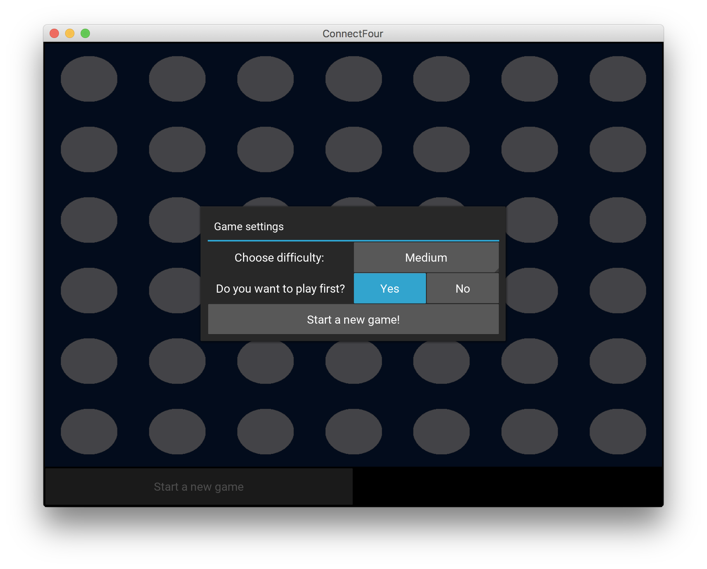
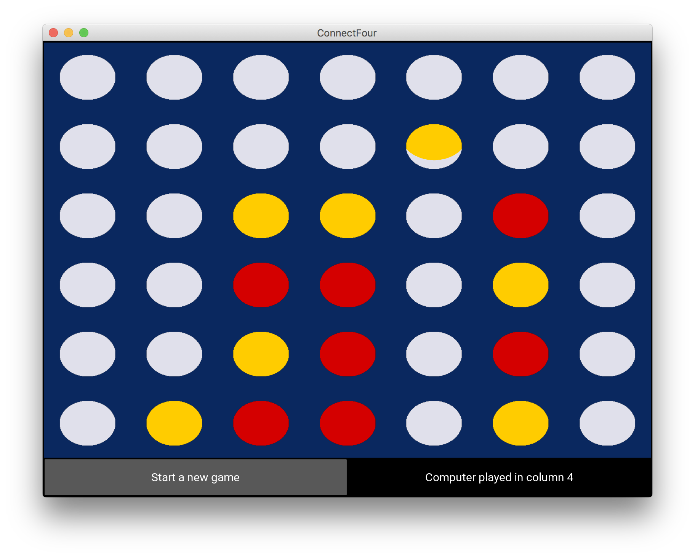
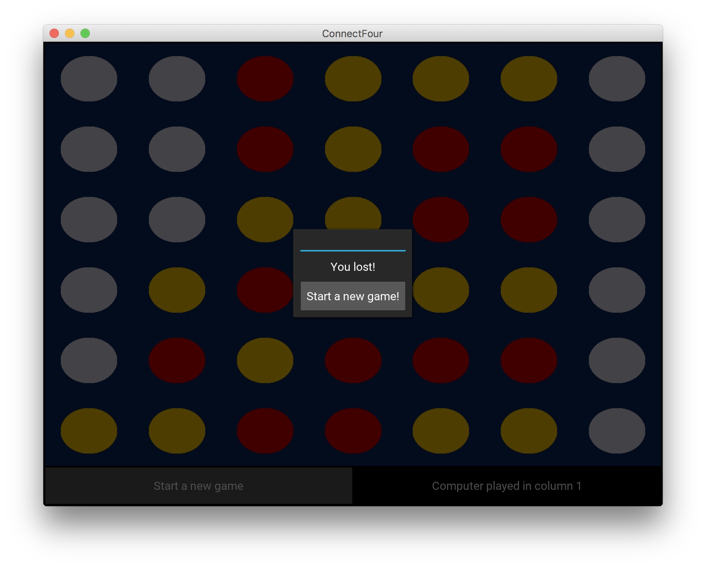

# AI for connect4

## About the application

This app is a game of Connect Four, where the player plays against the computer. Different levels of difficulty can be chosen.
The app is written in Python 3, using the Kivy for the interface.

With it, you can create an Android application, using buildozer module.


## Application screenshots

**Start menu**:



**During the game**:



**Game results**:




## Installation

You will need an environment with Python 3 and Kivy installed. Instructions to install Kivy can be found [here](https://kivy.org/docs/installation/installation.html).


## Running the app on your computer

To start the app, in Terminal, type:

```bash
cd connect-four
python connect-four-app.py
```

## Creating an APK file (Android application)
Here are the instructions to create an Android application for this App.

We'll be using python 3, so follow the installation instruction here: [Installing buildozer with Python 3 support](https://github.com/kivy/buildozer#installing-buildozer-with-python3-support).
At the time of writting, there is no valid recipe in python4android for numpy with Python 3.6 ([Numpy support](https://github.com/kivy/python-for-android/issues/882)). So you'll need to add a custom local recipe for numpy. @krinnewitz built one [here](https://github.com/kivy/python-for-android/issues/882). I put this recipe in `~/.buildozer/p4a/p4a-numpy/recipes`.

Once you've put the CrystaxNDK in `~/.buildozer` and the numpy recipe in `~/.buildozer/p4a/p4a-numpy/recipes`, you can build the APK file:

```bash
cd app 
buildozer android debug deploy run
```

## How does it work?

The AI of this app is built using the [minimax](https://en.wikipedia.org/wiki/Minimax) algorithm. To speed up the algorithm, the [alpha-beta pruning](https://en.wikipedia.org/wiki/Alpha%E2%80%93beta_pruning) is used. 

In the minimax algorithm, we need to define an evaluation function to score a given grid with coins from both players. The evaluation function is implemented as such:
- For each player, we count the number of alignment of 1, 2 or 3 coins which can be completed to obtain 4 coins in a row
- An alignment of 1 coin has a value of 1, 2 coins a value of 10, 3 coins a value of 100.
- The final score is the difference between the value of player 1 and player 2.

The different levels of difficulty that the user can choose correspond to the number of moves considered for the minimax algorithm. Easy, Medium and Hard levels respectively correspond to 3, 4 and 5 moves.

